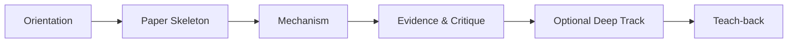
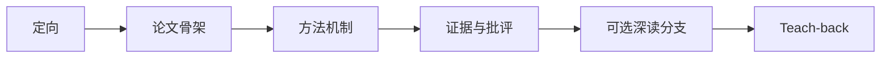

# Paper Coach

[](https://agentskills.io/specification)
[](https://github.com/nohairblingbling/paper-coach/actions/workflows/ci.yml)
[](LICENSE)

**An interactive research-paper reading coach—not another one-shot summarizer.**

[English](#english) · [简体中文](#简体中文)

---

# English

## What is Paper Coach?

Paper Coach is an [Agent Skills](https://agentskills.io/specification)-compatible workflow that helps a reader understand a research paper through **progressive disclosure, active recall, and evidence-grounded feedback**.

Instead of immediately generating a polished summary, it reveals the paper in stages, asks the reader to form an interpretation, fills any missing answers after one response, and moves forward. The goal is not to make the agent look knowledgeable; the goal is to help the reader build a usable mental model of the paper.

Paper Coach supports:

- **Quick mode** for rapid triage and high-level understanding;
- **Deep mode** for method, evidence, critique, mathematics, code, and research transfer;
- prompts and papers in **any language**;
- AI/ML-aware analysis without being limited to machine-learning papers;
- most agent harnesses that support `SKILL.md` or can read Markdown instructions.

## Why not just summarize the paper?

A good summary can save time, but it can also create an illusion of understanding. The reader may recognize the agent's explanation without being able to:

- state the authors' actual goal;
- reconstruct the mechanism;
- connect a claim to its evidence;
- identify assumptions or limitations;
- transfer the idea to a new problem;
- decide which references are worth following.

Paper Coach keeps the efficiency of an AI assistant while reserving one deliberate cognitive step for the reader at each checkpoint.

## Quick Start

Attach or link a paper and invoke one of the two modes.

```text
Use Paper Coach to quick-read this paper: paper.pdf
```

```text
Use Paper Coach to deep-read this paper: https://arxiv.org/pdf/...
```

Chinese examples:

```text
使用 Paper Coach 速通一下这篇文章：paper.pdf
```

```text
使用 Paper Coach 精读一下这篇文章：paper.pdf
```

The response language follows the current prompt. Source quotations stay identifiable in the paper's original language.

## Two Reading Modes

| | Quick mode | Deep mode |
|---|---|---|
| Purpose | Triage and rapid understanding | Working or research-level understanding |
| Reading packet | Title, Abstract, key figures/captions, selected Introduction/Conclusion excerpts | Progressive passes through structure, Method, experiments, and critique |
| Questions | Exactly Andrew Ng's four questions | 3–5 stage-specific questions per checkpoint |
| Answer opportunities | One total checkpoint | One opportunity per checkpoint |
| If the reader skips or says “I don't know” | Fill all four answers and close | Fill the current answers and advance immediately |
| Typical outcome | 30-second explanation + relevance decision + next action | Teach-back + claim–evidence map + limitation + transfer or reproduction path |

### Quick mode

Paper Coach presents a high-information packet, then asks exactly:

1. What did the authors try to accomplish?
2. What were the key elements of the approach?
3. What can you use yourself?
4. What other references do you want to follow?

The user gets one reply. A complete answer, partial answer, “I don't know”, or “skip” all count. The next response fills every gap and closes the quick read—there is no second comprehension loop.

### Deep mode



Each checkpoint follows the same compact contract:

```text
Reveal current material
→ ask one grounded question set
→ wait for one user reply
→ complete every missing answer using only that material
→ close the checkpoint
→ reveal the next stage
```

No repeated Socratic loop is required. If the reader wants to stay, they can explicitly say so.

## The Andrew Ng Method Behind Paper Coach

Paper Coach is inspired by Andrew Ng's public lecture on reading research papers:

> **Stanford CS230: Deep Learning | Autumn 2018 | Lecture 8 — Career Advice / Reading Research Papers**  
> Official Stanford Online video: [YouTube](https://www.youtube.com/watch?v=733m6qBH-jI)  
> Paper-reading segment: approximately **2:25–29:40**; single-paper multiple passes begin around **6:25**.

### 1. Build a literature map, not a linear queue

When entering a field:

- assemble an initial list of papers and serious supporting material;
- skim across papers instead of finishing each one in order;
- drop low-value papers early;
- invest in seminal or especially relevant papers;
- follow citations selectively and return to earlier papers as context improves.

The lecture gives rough heuristics: **5–20 papers** can provide basic working familiarity, while **50–100 well-understood papers** can support strong knowledge of an area. These are directional heuristics, not a mastery score.

### 2. Read one paper in multiple passes

| Pass | Read first | Defer initially | Goal |
|---|---|---|---|
| 1 | Title, Abstract, key figures and captions | Most prose and mathematics | Form a provisional model of the paper |
| 2 | Introduction, Conclusion/Discussion, figures again; skim the rest | Related Work if the field is unfamiliar | Build the problem–gap–contribution skeleton |
| 3 | Main prose, Method, experiments | Dense mathematical detail | Reach a working understanding |
| 4 | Important equations, code, key references | Low-value details | Re-derive, reproduce, critique, or extend |

### 3. Test understanding with four questions

The four questions above capture accomplishment, mechanism, transfer, and citation direction. Paper Coach uses them once in quick mode and once in the final teach-back of deep mode.

### 4. Re-derive mathematics and reimplement code

For mathematical understanding, Ng recommends reading and annotating a derivation, setting it aside, and reconstructing it from a blank page. For code, running the official implementation is a lightweight test; rebuilding the core method is a stronger one.

### 5. Prefer steady practice over cramming

Regular reading builds familiarity with recurring paper conventions—architecture diagrams, result tables, ablations, and argumentative patterns. A few papers every week is more valuable than one isolated burst.

For the full distilled reference, see [`andrew-ng-method.md`](skills/paper-coach/references/andrew-ng-method.md).

## What Paper Coach Adds

The following are Paper Coach design choices, not claims that Andrew Ng prescribed this exact dialogue protocol:

### One response per checkpoint

The user is never trapped in a long hint loop. After one response, Paper Coach fills the gaps and advances.

### Local evidence boundary

A question, its expected answer, and its later correction must all be supported by material shown **before the question**. The question itself cannot smuggle in a quote or result from a later section.

This prevents a common failure mode: asking an Abstract-stage question, then using an unrevealed experiment to mark the reader wrong.

### Source/interpretation separation

Paper Coach distinguishes:

- **Paper states** — directly supported by the source;
- **Reader interpretation** — the user's reconstruction;
- **Coach inference** — transfer ideas or critique;
- **Open question** — unresolved by available evidence.

### Figure honesty

A caption is not a figure. If the agent can read only captions, it must not pretend to have inspected curves, arrows, colors, layouts, or axes.

### Multilingual interaction

Prompts and questions follow the user's language. Quotations remain identifiable, and translations are labeled.

## Installation

### Universal installer: `npx skills`

The [`skills`](https://github.com/vercel-labs/skills) CLI supports dozens of agent harnesses.

Interactive installation:

```bash
npx skills@latest add nohairblingbling/paper-coach
```

Install globally for common harnesses:

```bash
npx skills@latest add nohairblingbling/paper-coach \
  -g -y -a claude-code codex gemini-cli opencode
```

Install only this skill when a repository contains several skills:

```bash
npx skills@latest add nohairblingbling/paper-coach -s paper-coach
```

### Hermes Agent

Direct install:

```bash
hermes skills install nohairblingbling/paper-coach/skills/paper-coach
```

Or subscribe to the repository as a tap:

```bash
hermes skills tap add nohairblingbling/paper-coach
hermes skills install nohairblingbling/paper-coach/paper-coach
```

Then start a new Hermes session and invoke `/paper-coach` or use natural language.

### Manual installation

Clone the repository and copy or symlink `skills/paper-coach/` into the skill directory your harness scans.

Common locations include:

| Harness | Typical user-level location |
|---|---|
| Claude Code | `~/.claude/skills/paper-coach/` |
| Codex | `~/.agents/skills/paper-coach/` |
| Gemini CLI | `~/.gemini/skills/paper-coach/` |
| OpenCode | `~/.config/opencode/skills/paper-coach/` |
| Hermes Agent | `~/.hermes/skills/research/paper-coach/` |

If your harness does not implement Agent Skills, point it directly at `skills/paper-coach/SKILL.md` as a reusable system/project instruction.

## Optional PDF Page Mapper

The coaching workflow has no mandatory runtime dependency. An optional helper improves local PDF structure and page locators:

```bash
python skills/paper-coach/scripts/build_paper_map.py paper.pdf \
  --out-dir .paper-coach/paper-name
```

Optional executables:

- [Miyo](https://miyo.md/) for PDF → Markdown/JSON structure;
- Poppler `pdftotext` for 1-indexed page boundaries.

If either is unavailable, use the harness's native PDF/file reader. The skill must not fail merely because the helper cannot run.

## Repository Layout

```text
paper-coach/
├── README.md
├── LICENSE
├── CITATION.cff
├── skills/
│   └── paper-coach/
│       ├── SKILL.md
│       ├── references/
│       ├── examples/
│       └── scripts/
├── tests/
└── .github/workflows/ci.yml
```

The canonical skill lives under `skills/paper-coach/`, which is discoverable by Agent Skills installers and can also serve as a Hermes tap.

## Validation

```bash
python scripts/validate_repo.py
python -m unittest discover -s tests -v
```

If `skills-ref` is installed, the open specification validator can also be used:

```bash
uvx --from skills-ref agentskills validate skills/paper-coach
```

## Contributing

Issues and pull requests are welcome, especially for:

- discipline-specific question patterns;
- better multilingual section detection;
- figure/table grounding;
- reproducibility and code-reading tracks;
- evaluations that measure learner understanding rather than summary quality.

See [CONTRIBUTING.md](CONTRIBUTING.md).

## Attribution and Disclaimer

The paper-reading method is distilled from Andrew Ng's CS230 lecture linked above. This repository contains an independent synthesis and interaction design; it does not reproduce the lecture transcript.

## License

MIT. See [LICENSE](LICENSE).

---

# 简体中文

## Paper Coach 是什么？

Paper Coach 是一套兼容 [Agent Skills 开放规范](https://agentskills.io/specification)的交互式论文阅读工作流。它通过**渐进式披露、主动回忆和基于证据的反馈**帮助读者真正理解论文，而不是直接交付一份看似完整的总结。

它会分阶段展示论文，让读者先形成自己的理解；无论读者回答完整、缺失、错误或“不知道”，下一轮都会补齐答案并继续，不会陷入冗长的反复追问。

Paper Coach 支持：

- 用于快速筛选和掌握主旨的**速通模式**；
- 用于方法、证据、批评、数学、代码和研究迁移的**精读模式**；
- **任意语言**的 prompt 和论文；
- 针对 AI/ML 论文优化，但不限于机器学习领域；
- 大多数支持 `SKILL.md` 或能够读取 Markdown 指令的 agent harness。

## 为什么不直接总结？

优秀的论文总结能够节省时间，但也可能制造“我已经理解”的错觉。读者可能看得懂 AI 的解释，却无法独立完成：

- 说明作者真正想解决的问题；
- 重构方法机制；
- 把论文主张对应到具体证据；
- 识别假设和限制；
- 将思想迁移到新问题；
- 判断哪些引用值得追踪。

Paper Coach 保留 AI 助手的效率，同时在每个 checkpoint 为读者保留一次必要的认知参与。

## 快速开始

上传或链接论文，然后选择模式：

```text
使用 Paper Coach 速通一下这篇文章：paper.pdf
```

```text
使用 Paper Coach 精读一下这篇文章：https://arxiv.org/pdf/...
```

英文同样可用：

```text
Use Paper Coach to quick-read this paper: paper.pdf
```

回答语言跟随当前 prompt；论文原文引用保持可识别，翻译和 Coach 转述会明确标注。

## 两种阅读模式

| | 速通模式 | 精读模式 |
|---|---|---|
| 目标 | 快速筛选和掌握主旨 | 形成工作性或研究级理解 |
| 阅读材料 | Title、Abstract、关键图表、必要的 Introduction/Conclusion 摘录 | 逐步进入论文结构、Method、实验和批评 |
| 问题 | 只问 Andrew Ng 的四个问题 | 每阶段 3–5 个针对性问题 |
| 作答机会 | 总共一个 checkpoint | 每个 checkpoint 一次 |
| 用户跳过或“不知道” | 下一轮补齐四问并结束 | 下一轮补齐当前答案并直接推进 |
| 最终产出 | 30 秒解释、相关性判断、下一步 | Teach-back、claim–evidence map、限制和迁移/复现路线 |

### 速通模式

Paper Coach 展示高信息密度的材料，然后只问四个问题：

1. 作者试图完成什么？
2. 方法的关键要素是什么？
3. 你自己能用到什么？
4. 你想继续追踪哪些参考文献？

用户只有一次回复机会。完整回答、部分回答、“不知道”或跳过都算作答。下一轮直接补齐所有内容并收尾，不再开启第二轮理解题。

### 精读模式



每个 checkpoint 都遵循：

```text
展示本阶段材料
→ 提出一组有证据基础的问题
→ 等待用户回复一次
→ 仅用本阶段已展示材料补齐答案
→ 关闭本阶段
→ 揭示下一阶段
```

不会强制进行反复的苏格拉底式追问；如果读者想停留，可以明确提出。

## Paper Coach 背后的吴恩达论文阅读方法

Paper Coach 的核心阅读顺序来自 Andrew Ng 在 Stanford CS230 中公开讲授的论文阅读方法：

> **Stanford CS230: Deep Learning | Autumn 2018 | Lecture 8 — Career Advice / Reading Research Papers**  
> Stanford Online 官方视频：[YouTube](https://www.youtube.com/watch?v=733m6qBH-jI)  
> 论文阅读部分约为 **2:25–29:40**；单篇论文 multiple passes 约从 **6:25** 开始。

### 1. 建立文献地图，而不是线性队列

进入一个新领域时：

- 先建立论文和高质量学习材料列表；
- 在多篇论文之间跳读，不要强迫自己逐篇从头读到尾；
- 尽早淘汰低价值或不相关论文；
- 对 seminal 或高度相关论文投入更多时间；
- 有选择地追踪引用，并在获得新背景后返回之前只读了一部分的论文。

讲座给出的粗略参考是：阅读 **5–20 篇**可以形成基础工作性认识；理解 **50–100 篇**可以形成较强的领域认知。这只是方向性 heuristic，不是掌握度分数。

### 2. 对单篇论文进行 multiple passes

| Pass | 优先阅读 | 初期暂缓 | 目标 |
|---|---|---|---|
| 1 | Title、Abstract、关键 Figures/Captions | 大部分正文和数学 | 建立论文的暂定心智模型 |
| 2 | Introduction、Conclusion/Discussion、再次查看图表并 skim 其余部分 | 陌生领域可先跳过 Related Work | 建立 problem–gap–contribution 骨架 |
| 3 | 正文、Method、实验 | 密集数学细节 | 形成工作性理解 |
| 4 | 关键公式、代码、重要引用 | 低价值细节 | 重推、复现、批评或发展新研究 |

### 3. 用四个问题检查理解

这四问分别检查研究目标、方法机制、知识迁移和引用方向。Paper Coach 在速通模式中使用一次，在精读最终 teach-back 中再使用一次。

### 4. 通过重推数学和重写代码检查深度理解

对于数学，先阅读并记录推导，然后合上论文，从空白纸重新推导，再对照遗漏的假设和步骤。对于代码，运行官方实现是较轻量的测试；从头重写核心方法是更深入的理解测试。

### 5. 稳定阅读优于短期突击

持续阅读会建立对论文惯例的模式识别能力，例如架构图、结果表、ablation 和论证结构。每周稳定读几篇，比一次性集中突击更有效。

完整提炼见 [`andrew-ng-method.md`](skills/paper-coach/references/andrew-ng-method.md)。

## Paper Coach 增加了什么？

以下是 Paper Coach 的交互设计，并不是声称 Andrew Ng 规定了完全相同的对话协议。

### 每个 checkpoint 只给一次作答机会

读者不会被困在冗长提示循环里。一次回复之后，Paper Coach 就会补齐答案并继续。

### 局部证据边界

问题、标准答案和下一轮纠错，都必须只依赖**提问前已展示**的材料。问题本身不能偷偷加入后续章节的引用、定义或结果。

这可以避免一种常见失败：在 Abstract 阶段提问，却拿尚未展示的实验结果判定读者回答错误。

### 区分来源与解释

Paper Coach 明确区分：

- **论文明确陈述**：原文直接支持；
- **读者理解**：用户自己的重构；
- **Coach 推断**：迁移建议或批评；
- **开放问题**：当前证据无法解决。

### 对图表保持诚实

Caption 不等于 Figure。如果 agent 只能读取题注，就不能声称已经看到了曲线、箭头、颜色、布局或坐标轴。

### 多语言交互

问题和说明跟随用户的语言；原文引用保持可识别；翻译必须标注。

## 安装

### 通用安装器：`npx skills`

[`skills`](https://github.com/vercel-labs/skills) CLI 支持数十种 agent harness。

交互式安装：

```bash
npx skills@latest add nohairblingbling/paper-coach
```

为常用 harness 进行全局安装：

```bash
npx skills@latest add nohairblingbling/paper-coach \
  -g -y -a claude-code codex gemini-cli opencode
```

### Hermes Agent

直接安装：

```bash
hermes skills install nohairblingbling/paper-coach/skills/paper-coach
```

或者订阅为 tap：

```bash
hermes skills tap add nohairblingbling/paper-coach
hermes skills install nohairblingbling/paper-coach/paper-coach
```

然后新建 Hermes 会话，通过 `/paper-coach` 或自然语言调用。

### 手动安装

克隆仓库，将 `skills/paper-coach/` 复制或软链接到 agent 的 skills 目录。常见位置：

| Harness | 常见用户级路径 |
|---|---|
| Claude Code | `~/.claude/skills/paper-coach/` |
| Codex | `~/.agents/skills/paper-coach/` |
| Gemini CLI | `~/.gemini/skills/paper-coach/` |
| OpenCode | `~/.config/opencode/skills/paper-coach/` |
| Hermes Agent | `~/.hermes/skills/research/paper-coach/` |

如果某个 harness 尚未原生支持 Agent Skills，可以直接把 `skills/paper-coach/SKILL.md` 作为可复用的 system/project instruction 使用。

## 可选 PDF 页码映射器

核心教学流程没有强制依赖。可选 helper 可以改善本地 PDF 的章节和页码定位：

```bash
python skills/paper-coach/scripts/build_paper_map.py paper.pdf \
  --out-dir .paper-coach/paper-name
```

可选依赖：

- [Miyo](https://miyo.md/)：PDF → Markdown/JSON 结构；
- Poppler `pdftotext`：保留 PDF 页边界。

如果依赖不存在，应回退到 harness 自带的 PDF/file reader，而不是让整个 skill 失败。

## 仓库结构

```text
paper-coach/
├── README.md
├── LICENSE
├── CITATION.cff
├── skills/
│   └── paper-coach/
│       ├── SKILL.md
│       ├── references/
│       ├── examples/
│       └── scripts/
├── tests/
└── .github/workflows/ci.yml
```

## 验证

```bash
python scripts/validate_repo.py
python -m unittest discover -s tests -v
```

如果已经安装 `skills-ref`，还可以使用开放规范验证器：

```bash
uvx --from skills-ref agentskills validate skills/paper-coach
```

## 贡献

欢迎 Issues 和 Pull Requests，尤其包括：

- 不同学科的提问模式；
- 更好的多语言章节识别；
- Figure/Table grounding；
- 复现与代码阅读分支；
- 衡量读者理解而不是总结质量的 evaluation。

详见 [CONTRIBUTING.md](CONTRIBUTING.md)。

## 来源声明与免责声明

论文阅读方法提炼自上方链接的 Andrew Ng CS230 公开讲座。本仓库是独立的总结和交互设计，不包含讲座转录文本。

## 许可证

MIT，详见 [LICENSE](LICENSE)。
